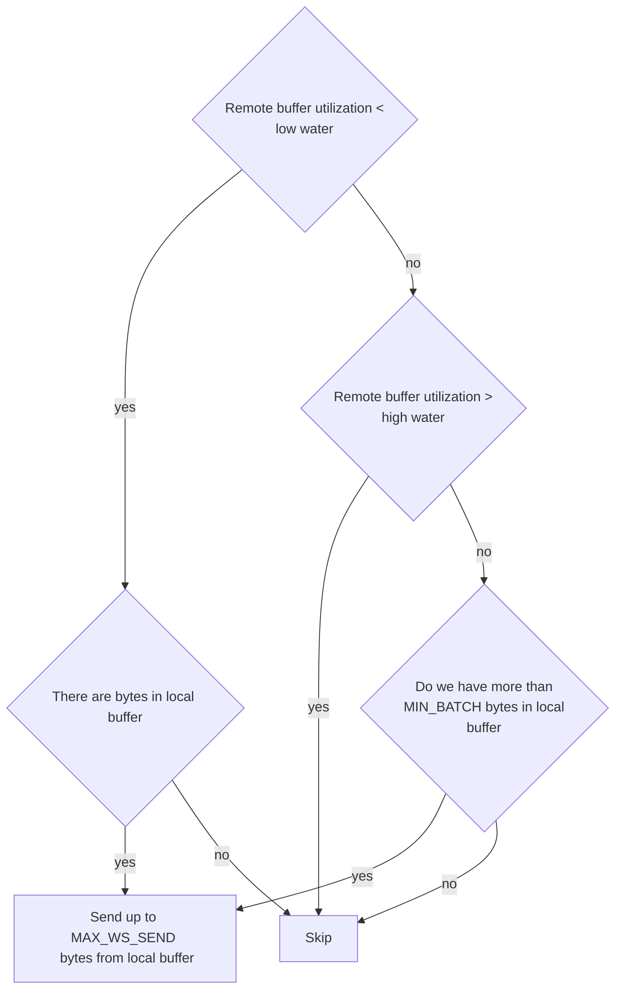

# pipecat-asterisk

A [Pipecat](https://github.com/pipecat-ai/pipecat) community integration for Asterisk. 
This repository provides a transport and frame serializer to connect your Asterisk with Pipecat pipelines.

## Features

- **`AsteriskWebsocketTransport`**: Handles raw audio streaming and lifecycle events natively with Asterisk.
- **`AsteriskFrameSerializer`**: Serializer to translate Asterisk websocket JSON or plain-text payloads and raw(audio) payloads into Pipecat frames.
- **Flow Control**: Built-in logic to manage buffer utilization between the Pipecat application and Asterisk.

## Installation

```bash
uv add pipecat-asterisk
```
*(Or use `pip install pipecat-asterisk` if you are using `pip` for dependency management)*

## Usage

Here is a basic example of how to integrate the Asterisk WebSocket transport into a Pipecat pipeline:

```python
from fastapi import FastAPI, WebSocket
from pipecat.pipeline.pipeline import Pipeline
from pipecat.pipeline.task import PipelineTask
from pipecat_asterisk import AsteriskWebsocketTransport

app = FastAPI()

@app.websocket("/ws")
async def websocket_endpoint(websocket: WebSocket):
    await websocket.accept()
    
    # Initialize the Asterisk Transport
    ws_transport = AsteriskWebsocketTransport(websocket=websocket)
    
    # Build your Pipecat pipeline
    pipeline = Pipeline([
        ws_transport.input(),
        # ... other pipeline components (VAD, LLM, TTS, etc.)
        ws_transport.output(),
    ])
    
    task = PipelineTask(pipeline)
    
    # Run the pipeline
    # ...
```

## Running the Example

An example Gemini-based voice bot is provided in `examples/pipecat_asterisk/`.

### 1. Configure Asterisk
The `examples/pipecat_asterisk/` directory includes a `docker-compose.yml` and Asterisk configuration files in `etc/` to easily spin up a local Asterisk testing environment. After the Docker container is running you can connect any sip client to `localhost:5060` with the credentials specified in `etc/asterisk/pjsip.conf` (user: `1`, password: `1`). There are a few extensions configured in `etc/asterisk/extensions.conf` that you can use to test the bot, every extension represents a respective sampling rate.

```
exten = 8,1,Dial(WebSocket/pipecat/c(slin))
exten = 12,1,Dial(WebSocket/pipecat/c(slin12))
exten = 16,1,Dial(WebSocket/pipecat/c(slin16))
exten = 24,1,Dial(WebSocket/pipecat/c(slin24))
...
```

To run the Asterisk server with the provided configuration:

```bash
cd examples/pipecat_asterisk
docker-compose up -d
```

### 2. Set API Keys
The example uses Google's Gemini for conversational AI. Create a `.env` file or export your key directly:

```bash
export GOOGLE_API_KEY="your-google-api-key"
```

### 3. Run the application
Run the WebSocket server:
```bash
uv sync
uv run examples/pipecat_asterisk/ws_server.py
```

## Compatibility

- Tested with **Pipecat v1.1.0**
- Requires **Python 3.12+**

## Internal Architecture

The transport and the serializer are designed to work with `slin` encoded audio, because Asterisk natively supports all the flavors of `slin` and Pipecat's audio frames require to be slin-encoded.
If you need to use a different codec, you can transcode on the Asterisk side, it's computationally more efficient and simplifies the transport and serializer logic.

Serializer and the transport implementation are based on the [Asterisk websocket channel documentation](https://docs.asterisk.org/Configuration/Channel-Drivers/WebSocket/).

The transport supports flow control logic to manage the buffer utilization between the Pipecat application and Asterisk. This ensures that we don't overwhelm the Asterisk server with too much data at once, while also ensuring that we send data as soon as there is capacity in the remote buffer. The output transport create an instance of flow controller and adds serialized (and resampled if needed) audio frames to the flow controller. The flow controller then decides when to send data to Asterisk based on the current buffer utilization and the amount of data in the local buffer. The flow control logic is as follows: 

### Flow control logic

## Nuances for self-closing pipelines

TTS-only pipelines, as well as any other pipelines where the `EndFrame` is queued using `task.queue_frame(EndFrame())` or `task.stop_when_done()`, suffer from the problem that the `EndFrame` leads to a closure of the WebSocket to Asterisk without regard for whether the audio has yet been played to the caller on the other side. This leads Asterisk to tear down any simple bridges of which the WebSocket channel is a member, and thus to hang up on the caller.

The `QUEUE_DRAINED` event (prompted by the `REPORT_QUEUE_DRAINED` command) is a robust solution to this problem. For convenience, `AsteriskWebsocketTransport` provides an async `wait_for_queue_drain()` method that can be `await`ed in your pipeline before closure:

```python
@app.websocket("/tts")
async def tts_endpoint(websocket: WebSocket):
    await websocket.accept()

    ws_transport = AsteriskWebsocketTransport(websocket=websocket)

    ...

    pipeline = Pipeline([
        ws_transport.input(),
        tts,
        ws_transport.output(),
    ])

    task = PipelineTask(pipeline)

    # Run the pipeline, etc.

    # Await queue drain on Asterisk side, then shut down.
    await ws_transport.wait_for_queue_drain()
    await task.stop_when_done()
```

Timing and order are important. One cannot send a `REPORT_QUEUE_DRAINED` request before media has actually been pushed to Asterisk's buffer, otherwise a `QUEUE_DRAINED` event will return immediately because the buffer is, as yet, empty. In practice, the execution of a pipeline as above may be bifurcated:

```python
@app.websocket("/tts")
async def tts_endpoint(websocket: WebSocket):
    ...
    
    runner = PipelineRunner(handle_sigint=False)
    runner_task = asyncio.create_task(runner.run(task))

    try:
        await task.queue_frame(TTSSpeakFrame("Hello World"))
        await ws_transport.wait_for_queue_drain()
        await task.stop_when_done()
        await runner_task # join async runner Task
    except Exception:
        runner_task.cancel()
```

Other elements would likely be required, such as a `FrameProcessor` that waits for a `TTSStoppedFrame` and fires an `asyncio.Event` or similar. These are beyond the scope of this project, but the clear intent is to say that calling `ws_transport.wait_for_queue_drain()` without being sure that something is remotely buffered first will likely not yield desired results.